# pol-street
Pol street is an Android Application that allows users to bet on political parties in regional , state and national level elections. A betting app that allows Indian on non-Indian citizen to bet on them and earn from it.

## What you should know
-Android basics (project structure, how to make hello world! app )

-Java, XML Basics

## Features
-Login using OTP

-User profile

-Edit profile

-Home page 

-Search

-Bet information

-Elections and Events

-Payment Options

-Add cardDetails

-Verify user with OTP 

## Techniques
RecycleView, ToolBar, CardView, ListView, NestedScroll, DrawerLayout, ActionBarDrawerToggle, NavigationView, ProgressBar, DialogFragment, Fragments and more.

## Developed By
* Author : Aman Pandey
* Email  : amanpandey12398@gmail.com

Here are some screenshots of app

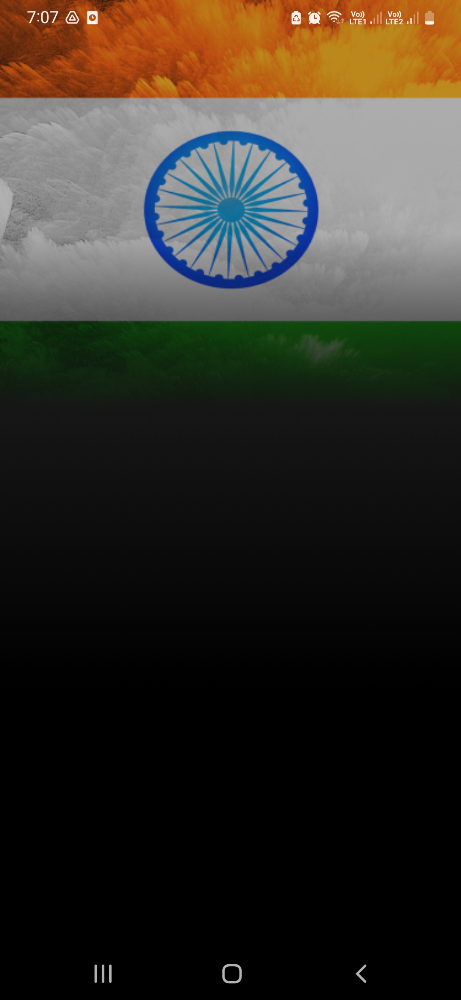
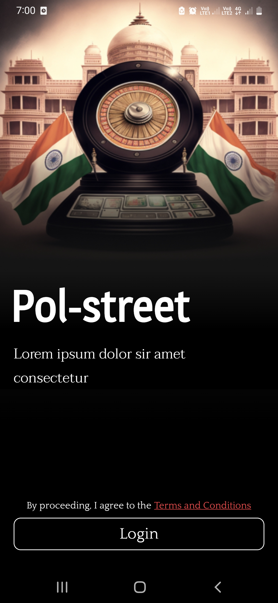
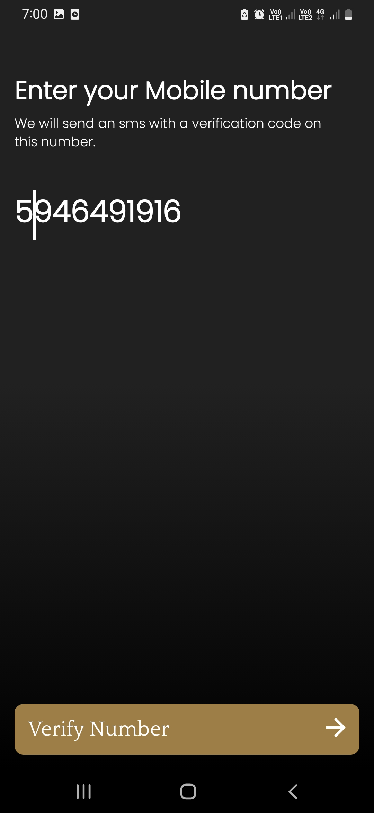

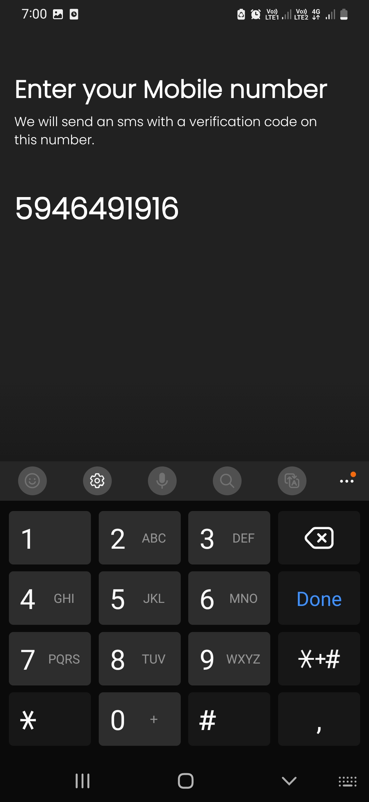
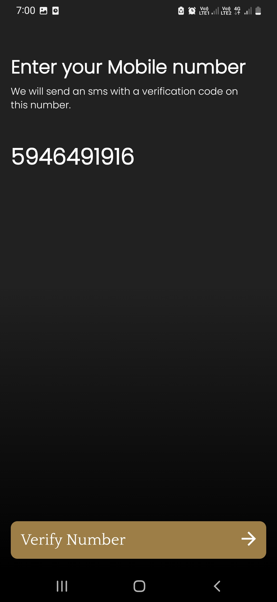
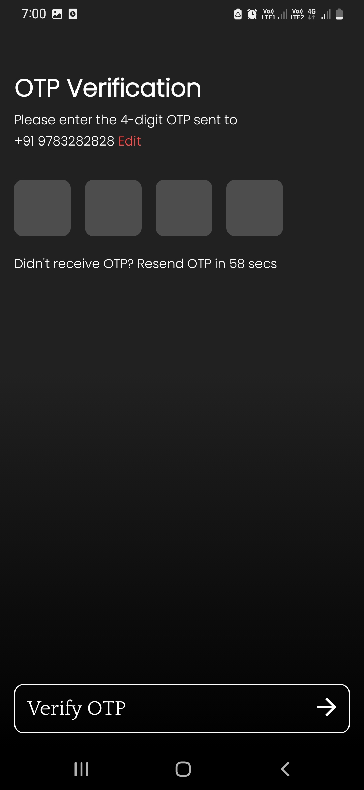

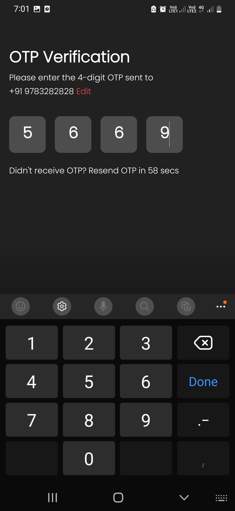
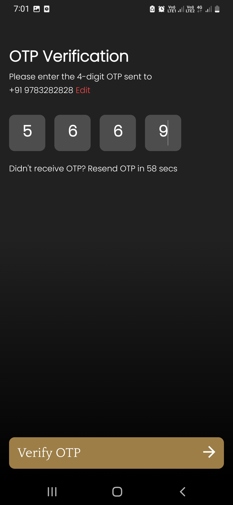
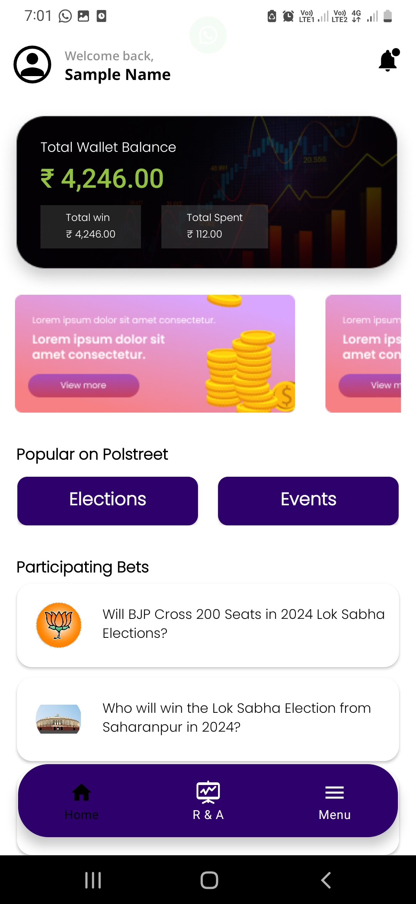

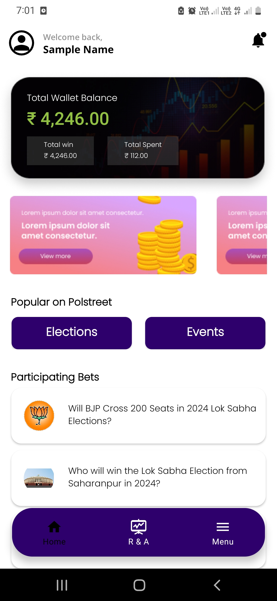
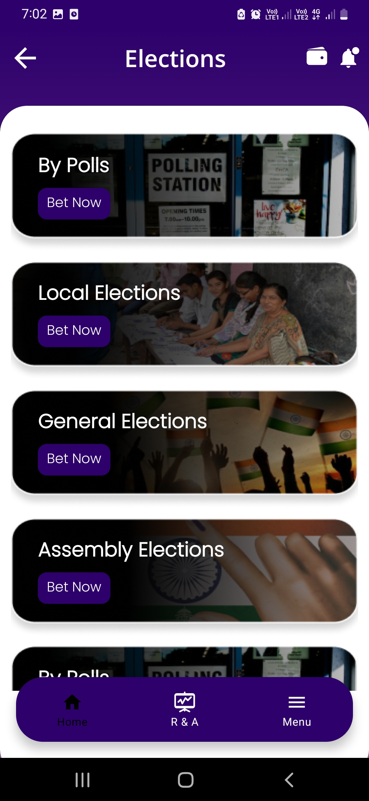
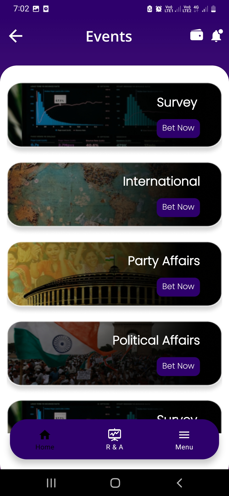

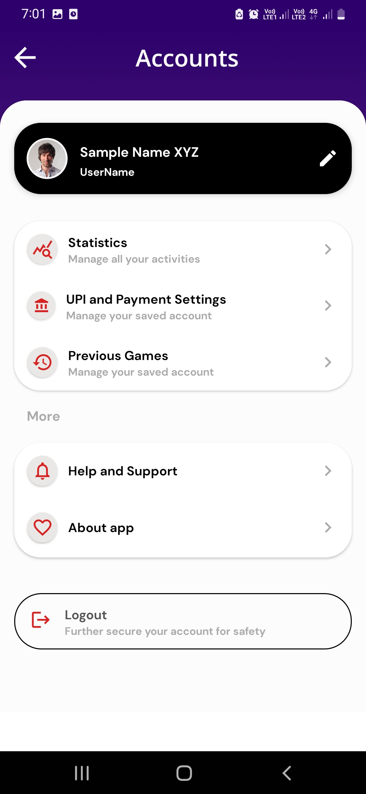
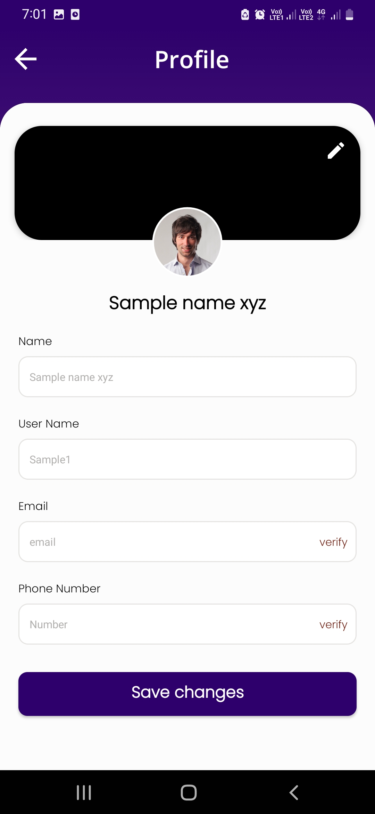
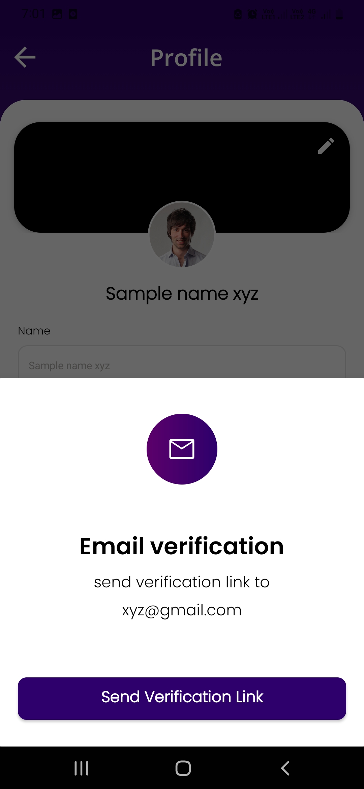

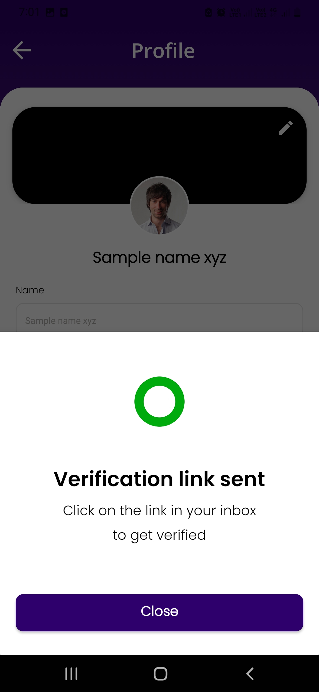
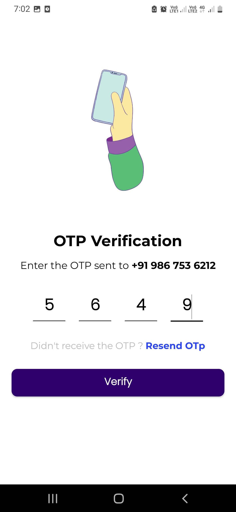
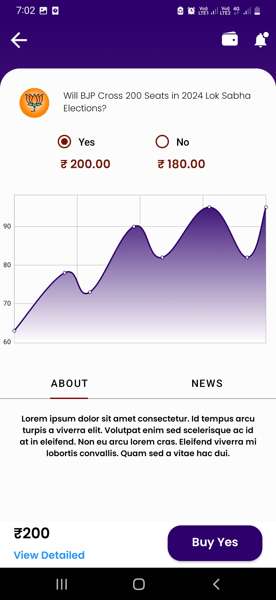

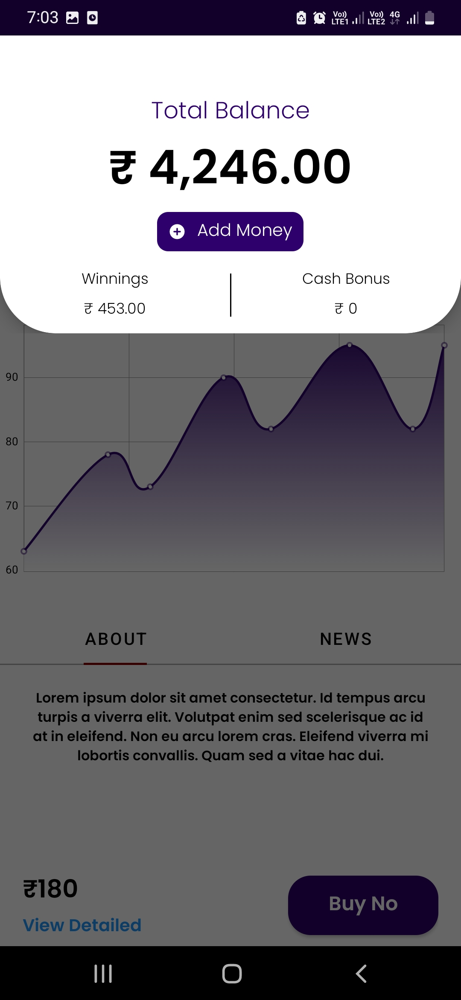

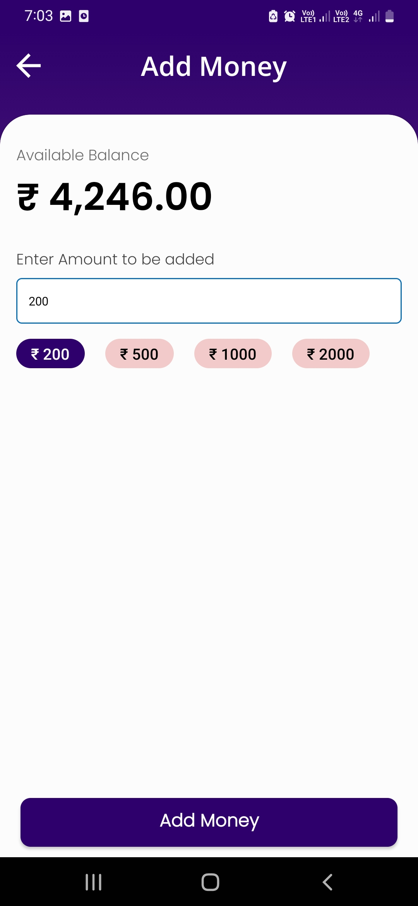
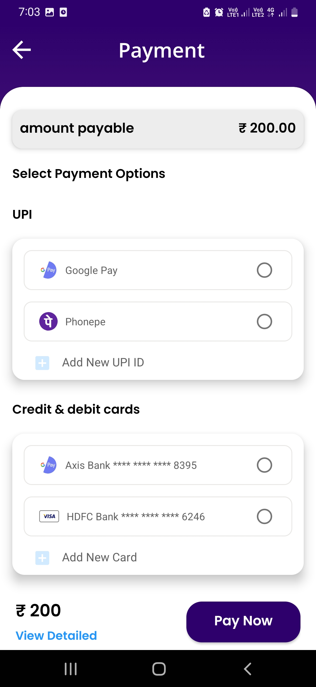
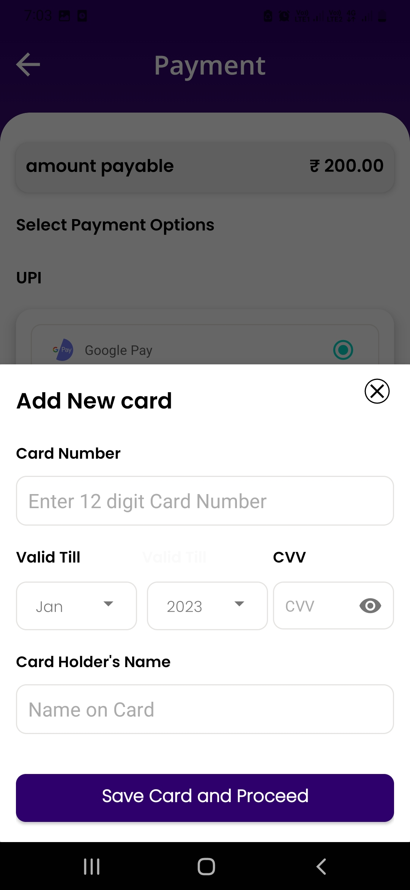

For further clarfications or doubts you can connect with me at amanpandey12398@gmail.com 
